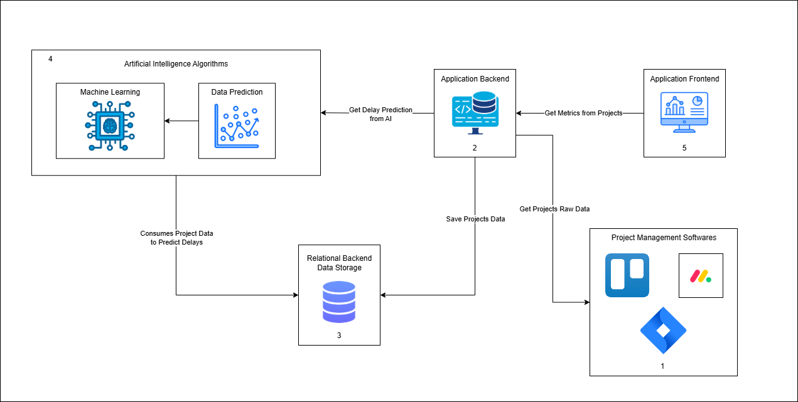

# Projeto: GERENCIAMENTO DE RISCOS PARA PROJETOS DE DESENVOLVIMENTO DE PRODUTOS DIGITAIS

**Acadêmica:** Brenda Aldrovandi Gaio  

**Orientador:** Andrei Carniel  
**Coorientador:** Tathiana Duarte do Amarente

**Docente responsável portfólio:** Tassiana Kautzmann  

## Resumo

Com o avanço do desenvolvimento de software, o modelo de desenvolvimento contínuo desafia as práticas tradicionais de gestão de projetos, onde as práticas de desenvolvimento contínuo têm se consolidado como um modelo eficaz para a entrega rápida e frequente de novas funcionalidades e melhorias, especialmente em projetos de desenvolvimento de produtos digitais, que seguem um ciclo de vida sem término definido. A abordagem proposta visa tratar a problemática do gerenciamento de riscos nesse cenário, destacando a falta de assertividade das abordagens convencionais, como metodologias de Scrum, Kanban e modelo cascata. Foram identificadas lacunas nas práticas existentes e propostas melhorias para uma gestão mais eficaz de riscos em projetos não tradicionais, concluindo que uma abordagem adaptada e flexível é essencial para promover o sucesso e a sustentabilidade desses projetos, priorizando a entrega contínua de valor.

## Explicação e contexto do Software

Na era digital atual, a indústria de software tem experimentado uma transição significativa para metodologias ágeis e práticas de desenvolvimento contínuo. Essas práticas são essenciais para suportar a demanda por inovação rápida e entrega frequente, moldando assim o panorama do desenvolvimento de produtos digitais. Diferente dos métodos tradicionais, o desenvolvimento contínuo promove um fluxo ininterrupto de entrega e atualização de funcionalidades, onde a gestão de riscos se torna um ponto amplamente discutido. Este novo paradigma exige adaptação, priorizando a adaptabilidade e a resposta rápida às mudanças sobre o seguimento de um plano rígido. O ambiente dinâmico do desenvolvimento contínuo exige estratégias que acompanhem o ritmo acelerado da inovação tecnológica, criando oportunidades para sistemas avançados de gestão de riscos.

## Objetivos

Os objetivos estão em torno da implementação de análise preditiva para gestão de riscos utilizando dados históricos e indicadores de desempenho para antecipar potenciais riscos antes que afetem o projeto. Além disso, o desenvolvimento de IA (Inteligência Artificial) para a análise integrada de dados será um dos objetivos, permitindo a sintetização e análise de dados de múltiplos projetos. A IA será capaz de fornecer insights complexos a partir de dados passados, como por exemplo, identificar projetos com maior probabilidade de atrasos na execução com base nos KPIs estipulados. Isso guiará tanto as decisões estratégicas quanto operacionais. Por meio de treinamento contínuo com vastos volumes de dados, espera-se que os modelos de IA evoluam e refinem suas capacidades analíticas, proporcionando uma visão aprofundada e holística dos projetos em desenvolvimento.

## Problemas a resolver

Os principais desafios enfrentados neste projeto decorrem da natureza do modelo de desenvolvimento contínuo de software (por exemplo, Scrum), que não possui um término definido, desafiando os métodos tradicionais de gestão de riscos. Esses métodos geralmente são projetados para ciclos com início, meio e fim claros. O projeto requer o desenvolvimento de estratégias que permitam uma gestão de riscos contínuo e adaptável, capaz de acompanhar as mudanças constantes e o ritmo acelerado do desenvolvimento de software. Além disso, é necessário a capacidade do sistema de analisar dados históricos e utilizar análises preditivas para prever problemas antes que eles impactem significativamente o projeto. Este aspecto é vital para permitir intervenções mais eficazes e menos dispendiosas, além de um monitoramento contínuo que mantenha uma visão atualizada da saúde do projeto

## Requisitos Funcionais

| Código  | Descrição                                                                                                                   |
|---------|-------------------------------------------------------------------------------------------------------------------------------|
| RF001   | O sistema deve ser capaz de coletar e armazenar dados históricos de projetos anteriores para análise.                          |
| RF002   | O sistema deve realizar análise preditiva utilizando dados históricos e indicadores de desempenho para identificar potenciais riscos. |
| RF003   | O sistema deve realizar monitoramento contínuo dos indicadores de risco do projeto com dados atualizados.                              |
| RF004   | Implementação de um painel de controle que apresenta uma visão geral dos riscos atuais.             |
| RF005   | O sistema deve atualizar continuamente os dados para refletir as mudanças no ambiente de projeto.                             |
| RF006   | O sistema deve suportar a gestão de múltiplos projetos, proporcionando uma visualização mais ampla de diferentes projetos.   |

## Requisitos Não Funcionais

| Código  | Descrição                                                                                                             |
|---------|-----------------------------------------------------------------------------------------------------------------------|
| RNF001  | O sistema deve ser escalável para acomodar o crescimento do volume de dados e complexidade dos projetos.              |
| RNF002  | Alta performance para garantir que o monitoramento em tempo real seja eficaz sem causar atrasos.                      |
| RNF003  | Proteção de dados para garantir a confidencialidade e integridade das informações.                                    |
| RNF004  | Interface intuitiva para garantir que os usuários possam facilmente navegar e utilizar o sistema sem treinamento extensivo. |
| RNF005  | Alta confiabilidade para assegurar que o sistema está sempre disponível e operante, especialmente em condições críticas. |
| RNF006  | Facilidade de manutenção para permitir atualizações e melhorias contínuas sem interrupções significativas do serviço.  |

## Detalhamento técnico do projeto

## Arquitetura do projeto

A arquitetura do projeto foi desenvolvida com foco em análise preditiva e visualização de métricas. Ela é composta por camadas interdependentes que garantem a coleta, armazenamento, processamento e exibição dos dados nos gráficos. Os principais componentes técnicos são:

*Softwares de Gerenciamento de Projetos (11):* Ferramentas como Jira, Trello e Monday podem atuar como fontes primárias de dados. Na uso do projeto, a escolha foi o Jira Cloud. Essas ferramentas fornecem informações detalhadas sobre o progresso dos projetos, tarefas, prazos e status por meio de APIs.

*Backend da Aplicação (2):* Desenvolvido em Java com Spring Boot, o backend é responsável por consumir os dados do software de gerenciamento, armazená-los no banco de dados e expor endpoints que retornam métricas de projetos para o frontend. Ele também é responsável por consumir os endpoints do algoritmo de IA, para receber as previsões de risco, a partir do modelo criado.

*Armazenamento de Dados Relacional (3):* Utilizado um banco de dados PostgreSQL para armazenar os dados dos projetos. Ele serve como repositório central para manter informações persistentes necessárias para análise e predições.

*Algoritmos de Inteligência Artificial (4):* Treinamento e geração do modelo: Implementado em Python com bibliotecas como Scikit-learn e XGBoost, os modelos de IA são treinados para realizar previsões de atrasos e riscos. O treinamento utiliza os dados armazenados dos projetos e é responsável por gerar e avaliar um modelo utilizando três algoritmos de aprendizagem, sendo eles XGBoost, Random Forest e Gradient Boost. O algoritmo de aprendizagem que tiver a melhor performance após o treino, irá compor o modelo utilizado pela API de predição.

API de predição de atrasos: Implementada em Python utilizando o framework FastAPI, a API de predição de atrasos utiliza o modelo treinado previamente para retornar uma previsão de atraso de uma determinada versão de projeto. O endpoint consumido pelo backend deve receber um ou mais identificadores de versão, após isso os dados necessários são consultados diretamente do banco de dados pela aplicação, assim, os dados de cada versão são enviados para o modelo, que retorna a previsão de atraso da versão especificada.

*Frontend da Aplicação (5):* Desenvolvido em Angular com Angular Material e G2Plot, o frontend consome os endpoints do backend e exibe métricas dos projetos, bem como previsões geradas pelos algoritmos de IA, proporcionando uma interface de simples leitura e entendimento para os usuários.

## Funcionalidades principais

O projeto tem como sua principal finalidade a geração de métricas que contribuem com a perspectiva de possíveis projetos futuros que podem possíveis ações para mitigar riscos já ocorridos e avaliados. Com base a isso, suas principais funcionalidades são:

1. Coletar dados de uma ferramenta de gerenciamento de projetos;
2. Fornecer um modelo de IA treinado capaz de gerar valor por meio de uma leitura gráfica sobre riscos de projetos;
3. Disponibilizar gráficos em uma interface para que gerentes de projetos, stakeholders e desenvolvedores possam olhar para a versão de um projeto já realizado ou em andamento e entender com base a ela, quais são suas características atribuídas (módulos desenvolvidos, prioridades, tipos de entregas..) para que assim entendam quais ações devem planejar e executar para que novas versões semelhantes não proporcionem o mesmo cenário de erro.

## Algoritmos de aprendizagem e features utilizadas

Como já citado na arquitetura do projeto acima, os algoritmos escolhidos foram: XGBoost, Random Forest e Gradient Boost. A escolha por três algoritmos deve-se ao fato de buscar o melhor resultado, permitindo a comparação entre eles e visando unir características de desbalanceamento de dados, melhores precisões, capacidade preditiva mais real e a comparação para a escolha de qual irá apresentar melhor desempenho nos dados, garantindo previsões mais precisas e confiáveis para identificar riscos nos projetos.

|Feature | Descrição |
|---------|---------|
| cod_version| ID da versão de um projeto |
| cod_project| ID do projeto |
|time_original_estimate| Estimativa de horas da atividade |
|timespent| Tempo gasto em horas na atividade |
|priority_Blocker| Prioridade do tipo blocker |
|priority_Critical| Prioridade do tipo critical |
|priority_Major| Prioridade do tipo major |
|priority_Minor| Prioridade do tipo minor |
|issuetype_Bug| Tipo de atividade como bug |
|issuetype_Improvement| Tipo de atividade como improvement |
|issuetype_New Feature| Tipo de atividade como new feature |
|issuetype_Risk| Tipo de atividade como risk |
|issuetype_Story| Tipo de atividade como story |
|issuetype_Task| Tipo de atividade como task |

## Linguagens, ferramentas e bibliotecas

De forma geral, a construção e desenvolvimento do projeto foi realizada, com o uso de diferentes linguagens, ferramentas e bibliotecas que proporcionaram melhor adaptação, conhecimento e facilidade de uso. 

Linguagens: 

Backend: Java; 
Frontend: HTML, CSS, TypeScript; 
IA: Python. 

Banco de dados:

Postgres SQL; 

Ferramentas:

IntelliJ IDEA; 
Visual Studio Code; 
PyCharm; 
Dbeaver; 
Postman; 
Git. 

Bibliotecas e frameworks:

Backend: Spring Boot, Liquibase, Lombok, Spring Security, Feign Client, Jackson. 
Frontend: Angular, Algular Material, G2Plot. 
IA: NumPy, FastAPI, SQLAlchemy, Joblib, Scikit-learn, pandas, XGBoost. 

## Modelagem de dados

## Cronograma e planejamento

