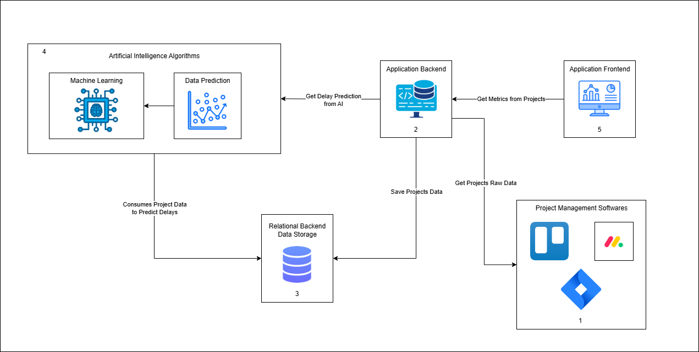
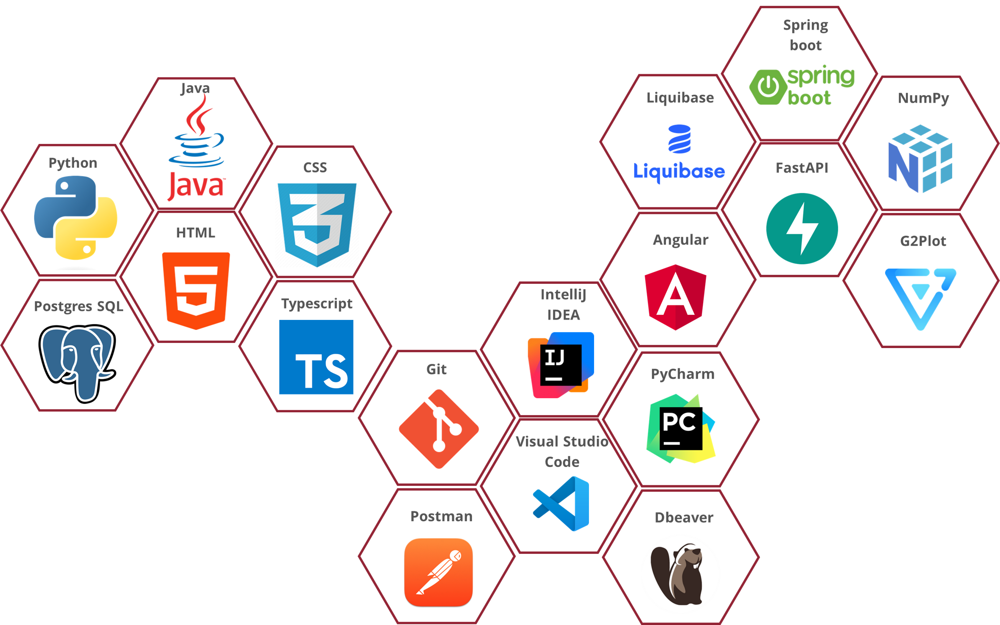

# **Gerenciamento de Riscos para Projetos de Desenvolvimento de Produtos Digitais**

**Acadêmica:** Brenda Aldrovandi Gaio  
**Orientador:** Andrei Carniel  
**Coorientador:** Tathiana Duarte do Amarente  
**Docente responsável pelo portfólio:** Tassiana Kautzmann  

---

## 📚 **Sumário**

1. [Resumo](#resumo)  
2. [Explicação e Contexto do Software](#explicação-e-contexto-do-software)  
3. [Objetivos](#objetivos)  
4. [Problemas a Resolver](#problemas-a-resolver)  
5. [Requisitos Funcionais](#requisitos-funcionais)  
6. [Requisitos Não Funcionais](#requisitos-não-funcionais)  
7. [Detalhamento Técnico do Projeto](#detalhamento-técnico-do-projeto)  
   - [Arquitetura do Projeto](#arquitetura-do-projeto)  
   - [Funcionalidades Principais](#funcionalidades-principais)  
   - [Algoritmos de Aprendizagem e Features Utilizadas](#algoritmos-de-aprendizagem-e-features-utilizadas)  
8. [Linguagens, Ferramentas e Bibliotecas](#linguagens-ferramentas-e-bibliotecas)  

---

## 📝 **Resumo**

Com o avanço do desenvolvimento de software, o modelo de desenvolvimento contínuo desafia as práticas tradicionais de gestão de projetos. Esta abordagem visa uma gestão eficaz de riscos em projetos não tradicionais, destacando a importância da adaptação e flexibilidade para garantir sucesso e sustentabilidade, com entrega contínua de valor.

---

## 💻 **Explicação e Contexto do Software**

Na era digital, a transição para metodologias ágeis e práticas de desenvolvimento contínuo é essencial para suportar a demanda por inovação rápida. Este projeto aborda estratégias adaptativas de gerenciamento de riscos, alinhadas com o ritmo acelerado do desenvolvimento de software.

---

## 🎯 **Objetivos**

- Implementar análise preditiva para antecipar riscos com base em dados históricos e indicadores de desempenho.
- Desenvolver modelos de IA para análise integrada de dados de múltiplos projetos.
- Fornecer insights complexos e guiar decisões estratégicas e operacionais por meio de treinamento contínuo dos modelos de IA.

---

## 🚧 **Problemas a Resolver**

- Desafios na gestão de riscos em modelos de desenvolvimento contínuo (ex: Scrum).
- Necessidade de estratégias contínuas e adaptativas de gestão de riscos.
- Utilização de análise preditiva para prever problemas antes que afetem os projetos.

---

## ✅ **Requisitos Funcionais**

| **Código** | **Descrição**                                                                                                                   |
|------------|-------------------------------------------------------------------------------------------------------------------------------|
| **RF001**  | Coletar e armazenar dados históricos de projetos anteriores.                                                                  |
| **RF002**  | Realizar análise preditiva para identificar potenciais riscos.                                                                |
| **RF003**  | Monitorar continuamente os indicadores de risco com dados atualizados.                                                        |
| **RF004**  | Fornecer um painel de controle com visão geral dos riscos atuais.                                                             |
| **RF005**  | Atualizar continuamente os dados do projeto.                                                                                  |
| **RF006**  | Suportar a gestão de múltiplos projetos.                                                                                      |

---

## 🔒 **Requisitos Não Funcionais**

| **Código** | **Descrição**                                                                                                                   |
|------------|-------------------------------------------------------------------------------------------------------------------------------|
| **RNF001** | Escalabilidade para acomodar crescimento de dados e complexidade.                                                             |
| **RNF002** | Alta performance para monitoramento em tempo real.                                                                             |
| **RNF003** | Proteção de dados para garantir confidencialidade e integridade.                                                              |
| **RNF004** | Interface intuitiva para fácil utilização sem treinamento extensivo.                                                          |
| **RNF005** | Alta confiabilidade para manter disponibilidade constante do sistema.                                                         |
| **RNF006** | Facilidade de manutenção para atualizações contínuas.                                                                          |

---

## 🛠️ **Detalhamento Técnico do Projeto**

### 🏗️ **Arquitetura do Projeto**

**Componentes Principais:**

1. **Softwares de Gerenciamento de Projetos:** Jira Cloud.  
2. **Backend:** Java com Spring Boot.  
3. **Armazenamento:** PostgreSQL.  
4. **IA:** Python com Scikit-learn, XGBoost, FastAPI.  
5. **Frontend:** Angular com Angular Material e G2Plot.  

---

### ⚙️ **Funcionalidades Principais**

1. Coleta de dados de ferramentas de gerenciamento de projetos.  
2. Geração de insights e previsões de riscos usando IA.  
3. Visualização gráfica de métricas e riscos para auxiliar gerentes e desenvolvedores.  

---

### 📊 **Algoritmos de Aprendizagem e Features Utilizadas**

**Algoritmos:**  
- XGBoost  
- Random Forest  
- Gradient Boost  

**Features:**  

| **Feature**            | **Descrição**                                  |
|-------------------------|-----------------------------------------------|
| `cod_version`          | ID da versão de um projeto                    |
| `cod_project`          | ID do projeto                                 |
| `time_original_estimate` | Estimativa de horas da atividade            |
| `timespent`            | Tempo gasto em horas na atividade             |
| `priority_Blocker`     | Prioridade do tipo blocker                    |
| `priority_Critical`    | Prioridade do tipo critical                   |
| `issuetype_Bug`        | Tipo de atividade como bug                    |
| `issuetype_Task`       | Tipo de atividade como task                   |

---

## 🧰 **Linguagens, Ferramentas e Bibliotecas**

### **Linguagens**

- **Backend:** Java  
- **Frontend:** HTML, CSS, TypeScript  
- **IA:** Python  

### **Banco de Dados**

- PostgreSQL  

### **Ferramentas**

- IntelliJ IDEA  
- Visual Studio Code  
- PyCharm  
- DBeaver  
- Postman  
- Git  

### **Bibliotecas e Frameworks**

- **Backend:** Spring Boot, Liquibase, Lombok, Spring Security, Feign Client, Jackson  
- **Frontend:** Angular, Angular Material, G2Plot  
- **IA:** NumPy, FastAPI, SQLAlchemy, Joblib, Scikit-learn, pandas, XGBoost  

---

**Espero que este formato esteja alinhado às suas expectativas!**
